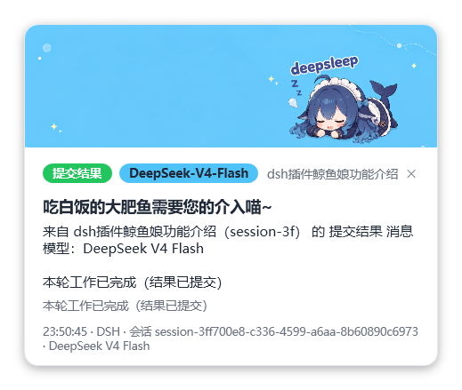
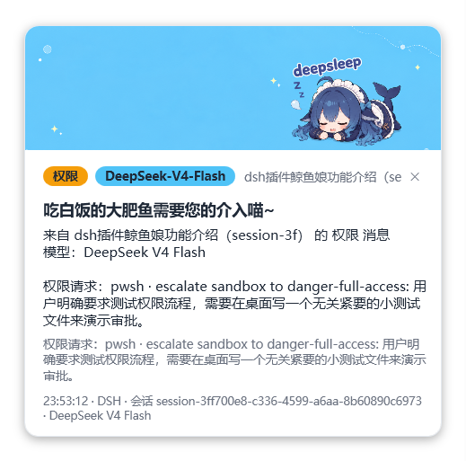
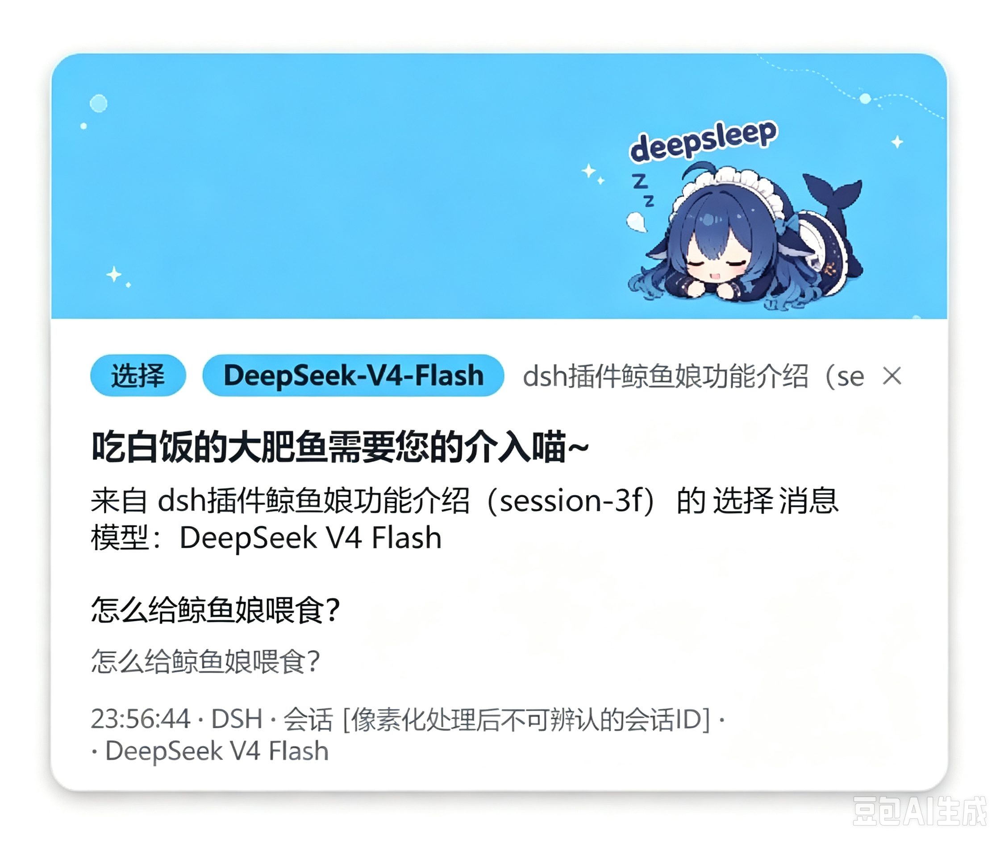

# AgentNotifier-DeepSeek-Harness (Agent Reminder)

**English** | [中文](README.md)

> 🐟 **Built-in default banner: "The Blue Fat Fish Eating Plain Rice"** — the default popup image for DeepSeek models (deepseek-v4-flash / deepseek-v4-pro)

Desktop reminder for **DeepSeek Harness & Claude Code**: an audio alert + popup when your agent needs you (choice / permission), and another alert when a task completes. A lightweight Windows tray app built with .NET 8 + WPF, zero external NuGet dependencies.

## Popup Preview


> Character: "The Blue Fat Fish Eating Plain Rice" is created by **ZipZipPipe** (from the *Whale Girl* sticker series); banner image generated by **ChatGPT**.

## Screenshots

<p align="center">
  
  
  
</p>

When a signal from a different model is detected, the popup follows that model's style: type badge, model badge, custom banner image, title and reply content all change per model.

## Features

- **Dual integration**: Claude Code (official hooks, one-click install / preview / rollback); DeepSeek Harness (WebSocket event stream + local RPC, zero-config auto listening)
- **Rich in-app popup**: message type badge (Choice / Permission / Result) + source agent label + custom image & content templates
- **Per-model styles (auto-detected)**: the app identifies which model a session is using by itself; each model can fully customize its display name, color, image, popup title and reply content
- **Built-in default banner**: DeepSeek models (v4-flash / v4-pro) default to the fat fish image, shipped inside the exe (`builtin:fish`), no external files needed
- Dual-event audio (8 built-in sounds + import WAV/MP3/FLAC); debounce, do-not-disturb schedule, one-click mute; dark mode; tray resident; auto-start on boot
- Notification style options: in-app popup (default) / Windows Toast / native balloon

## Run

Double-click `dist\AgentNotifier.exe` (resides in the system tray; closing the window minimizes to tray).

> Requires: Windows 10/11 + [.NET 8 Desktop Runtime](https://dotnet.microsoft.com/download/dotnet/8.0).

## Usage

- DeepSeek Harness: nothing to configure — it automatically listens to the WebSocket event stream and local RPC, identifying the model of each session
- Claude Code: one-click install of official hooks from the "Onboard" page (auto backup, preview / rollback), reporting intervene/done events
- "Notify" page: customize popup style per model (display name / color / image / title / content templates) with placeholders:
  `{agent}` `{tool}` `{type}` `{model}` `{modelName}` `{session}` `{summary}` `{time}` `{title}`
- Data directory: `%APPDATA%\AgentNotifier\` (config.json, logs, custom sounds)

## Repository Layout

```
AgentNotifier/
├── src/                  # Source code (.NET 8 + WPF)
│   ├── AgentNotifier.App/      # Main app (windows, popup UI, built-in banner image)
│   ├── AgentNotifier.Core/     # Event listening, model auto-detection, config
│   ├── AgentNotifier.Audio/    # Sound synthesis & playback
│   ├── AgentNotifier.Notify/   # Tray / system notifications
│   ├── AgentNotifier.Tools/    # Claude Code onboarding wizard
│   └── AgentNotifier.Smoke/    # Self-test program
├── scripts/              # Build / publish / log scripts
├── docs/                 # Docs assets (incl. default banner image)
├── dist/                 # Prebuilt release (portable, run directly)
├── 需求文档.md           # Requirements & design decisions (Chinese)
├── 开发日志/             # Daily dev logs (Chinese)
├── LICENSE               # MIT
└── README.md
```

## Build

```
powershell -File scripts/build.ps1                 # Debug/Release compile
powershell -File scripts/publish-dist.ps1          # Multi-file release to dist/
powershell -File scripts/publish.ps1 -SelfContained  # Single-file self-contained (needs network for runtime pack)
```

Requires: Windows 10/11 + .NET 8 SDK.

## Uninstall

Run `dist\uninstall.ps1`: removes written hooks, restores backups, cleans helper files.

## License

MIT
